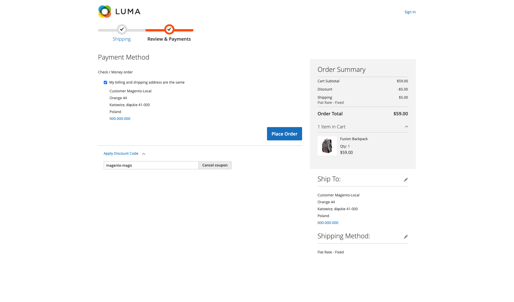

# Magento - Voucherify Integration

## Installation

 - Download and copy the Voucherify Integration source code to Magento server files to the path:
 ```
    $MAGENTO_ROOT/app/code/Voucherify/Integration
 ```
 > **NOTE:** Magento Custom Integration Extensions path template: `/app/code/{Vendor}/{Module}`

 - From Magento root directory level on Magento server execute following commands:
 ```
    $ bin/magento setup:upgrade
    $ bin/magento setup:di:compile
    $ bin/magento cache:clean

    # Voucherify extension depends on Voucherify PHP SKD package. Please install it, by executing in addition:
    $ composer require rspective/voucherify
```

## Configuration

 - Open Magento Admin Panel website and login
 - Go to `Stores/Configuration`. Under the Voucherify tab you must provide Voucherify api-keys. Once done, Customers will be able to provide and validate coupon code on the latest step of the checkout process.

 <p align="center" >
  
</p>

## Usage

 - Checkout summary page with Voucherify Discount Code apply form

<p align="center" >
  
</p>